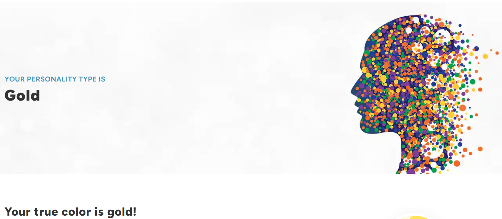

Submitted By: **Rajan Ghimire**  
Student ID: **C0924991**  

### True Colours Personality Assessment:

My true personality type is Gold. 

My dominant personality type is **Gold**. I am a detailed, responsible, and organized individual who values planning and predictability. I find comfort in structure and feel secure when things are well-organized and follow a plan. Tradition and family values are important to me, and I take pride in living by a high moral standard. I enjoy helping others, whether through volunteering or in my career, and I like being someone others can rely on.

I believe there is a right way to do things and strive to excel in my responsibilities. However, my preference for structure sometimes makes me resistant to change, and I can be critical when others don’t share my approach. I thrive in environments with clear expectations and defined roles, making careers in finance or public service particularly well-suited for me.

Here are some of my characteristicts: 

- Loyal
- Dependable 
- Prepared 
- Organized 
- Caring

### Reflection

#### Connection to Career Aspirations

As someone whose dominant personality type is Gold, I recognize that my detail-oriented nature and strong sense of responsibility are key components of my career aspirations.This is why I’m drawn to roles that require careful planning and organization, such as project management, data analysis, or even finance.

In my job search, I tend to prioritize opportunities that offer stability and a clear path for career progression. I’m naturally inclined to seek out companies with a solid reputation, where the day-to-day tasks are predictable, and the roles are well-established. For me, knowing what to expect and being able to plan ahead is crucial, and I find satisfaction in environments that provide a sense of security.

#### Strengths in a Professional Setting

One of my greatest strengths in a professional setting is my attention to detail. I take pride in ensuring that every task I undertake is completed accurately and efficiently. This is especially important in roles where precision is key, like data analysis or quality control. My reliability and sense of responsibility mean that I can always be counted on to meet deadlines and uphold my commitments, which are qualities I know any employer would value.
My organizational skills are another asset. I’m very effective at managing multiple tasks, prioritizing what’s important, and keeping a clear overview of ongoing projects. This makes me well-suited for roles that require coordination or project management, where keeping everything on track is essential.

#### Potential Challenges

While I see my Gold personality traits as strengths, I’m also aware of the challenges they can present. My preference for structure and predictability can sometimes make it difficult for me to adapt to fast-paced or rapidly changing environments. I recognize that in dynamic industries, where roles and expectations can shift frequently, I might struggle with ambiguity or a lack of clear direction.
I also realize that my strong adherence to rules and procedures might sometimes make me appear rigid in my thinking. This could be a drawback in situations that require creativity or innovative problem-solving. I know that in certain roles, especially those in creative fields or tech startups, flexibility and openness to new ideas are essential, and this is something I need to work on.

Finally, I recognize that my reliance on established methods could make me resistant to change. In a rapidly evolving job market, this might limit my ability to seize new opportunities or adapt to industry trends. During my job search, I need to be mindful of this tendency and ensure that I’m open to exploring unconventional career paths or industries that might offer greater growth potential, even if they’re outside my usual comfort zone.

### Action Plan Development

#### **Leveraging Strengths:**

1. **Job Search Strategy:**
   - **Target Roles:** I will focus on applying for positions that align with my strengths in organization, detail-orientation, and responsibility. This includes roles in project management, quality control, and finance. I’ll look for opportunities that emphasize stability and have well-defined responsibilities.
   - **Company Research:** I will research companies known for their structured environments and strong ethical standards. I’ll prioritize organizations that value long-term stability and clear career progression.

2. **Interview Preparation:**
   - **Highlight Strengths:** I will prepare to discuss specific examples from my past roles that demonstrate my attention to detail, reliability, and organizational skills. I’ll practice articulating how these traits have led to successful outcomes and contributed to previous projects.
   - **Prepare Questions:** I will prepare thoughtful questions about the company’s structure, team dynamics, and role expectations to ensure that the job aligns with my need for predictability and clear guidelines.

3. **Networking Approach:**
   - **Identify Contacts:** I will reach out to professionals in fields that value precision and structure, such as finance or engineering. I’ll use platforms like LinkedIn to connect with individuals who work in these industries.
   - **Engage in Events:** I will attend industry-specific networking events, webinars, and conferences where I can engage with like-minded professionals. I’ll focus on showcasing my passion for organized and ethical work environments.

#### **Addressing Challenges:**

1. **Enhancing Adaptability:**
   - **Seek Challenges:** I will actively seek projects or tasks that require me to adapt to changing conditions. For example, I might volunteer for assignments that involve learning new tools or dealing with unexpected issues.
   - **Embrace Change:** I’ll work on developing a mindset that views change as an opportunity for growth rather than a threat. I’ll read books or take courses on managing change and improving flexibility.

2. **Fostering Open-mindedness:**
   - **Explore Creativity:** I’ll engage in activities or side projects that encourage creative thinking and problem-solving. This could include participating in brainstorming sessions or taking part in innovation workshops.
   - **Collaborate:** I will seek opportunities to collaborate with colleagues or mentors who have different perspectives or work styles. This will help me learn to appreciate and incorporate diverse approaches.

3. **Managing Perfectionism:**
   - **Set Realistic Goals:** I will set achievable goals and deadlines for my tasks and projects. I’ll remind myself that perfection is not always necessary and that completing tasks efficiently is also valuable.
   - **Delegate Tasks:** I’ll practice delegating tasks to others and trust their abilities. This will help me reduce the tendency to micromanage and allow me to focus on higher-priority responsibilities.

#### **Professional Development:**

1. **Skill Enhancement:**
   - **Courses and Workshops:** I will enroll in courses or attend workshops that focus on enhancing flexibility, creative problem-solving, and adaptability. Potential topics could include agile project management, innovation techniques, or change management.
   - **Mentorship:** I will seek feedback from mentors or experienced colleagues on how to better handle situations that require adaptability. I’ll use their insights to adjust my approach and improve my ability to navigate unpredictable scenarios.

2. **Practical Application:**
   - **Project Involvement:** I will identify one project or initiative in my current role where I can practice being more flexible. I’ll take on tasks that push me out of my comfort zone and require quick thinking.
   - **Reflection:** I’ll regularly reflect on my experiences with adapting to new situations and implementing creative solutions. I’ll document what worked well and what didn’t, using this reflection to improve my approach over time.

#### **Implementation Steps:**

1. **Resume and LinkedIn Update:**
   - Over the next week, I will update my resume and LinkedIn profile to highlight my strengths and target roles that match my career aspirations. I’ll ensure that my profiles clearly reflect my organizational skills, reliability, and preference for structured environments.

2. **Networking Actions:**
   - I will schedule at least two networking events or informational interviews with professionals in fields that interest me. I’ll prepare questions and talking points that align with my strengths and career goals.

3. **Personal Development Goals:**
   - I will identify one specific area where I can work on being more adaptable. For example, I might take on a new responsibility at work or start a side project that involves a different skill set. I’ll track my progress and make adjustments as needed.

This detailed action plan will help me effectively utilize my Gold personality traits while addressing areas that need improvement, ensuring a strategic and balanced approach to my career development.